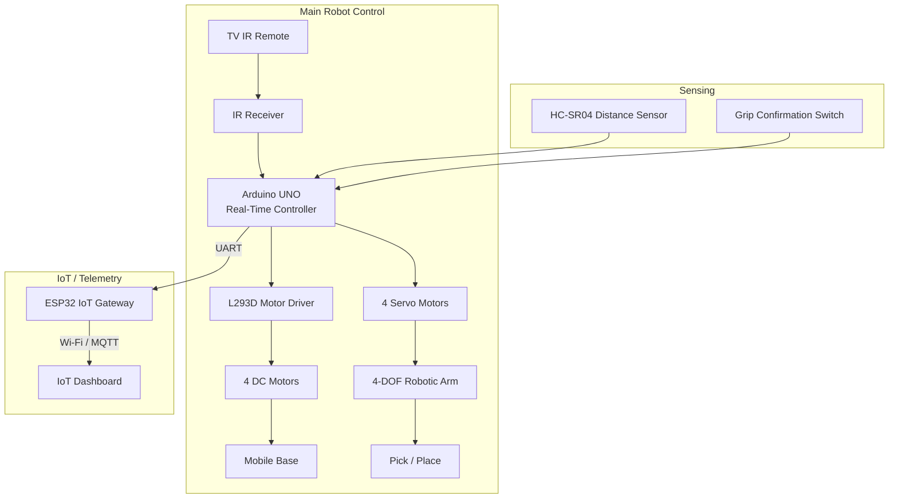

# RAVEN – IoT-Monitored Mobile Retrieval Robot
### IR-controlled mobile manipulator platform enhanced with sensor feedback and IoT telemetry for BUILDATHON 2026


---

## 1. Overview

**RAVEN** is a mobile robotic retrieval platform consisting of a 4-wheel IR-controlled vehicle and a 4-DOF robotic arm capable of pick-and-place operations. The mechanical and control platform — motor drive, IR control, and robotic arm — is an **existing, previously validated build**.

For BUILDATHON 2026 (Domain 6 – IoT & Embedded Systems), the platform is being enhanced with a **sensing and IoT telemetry layer**: distance sensing before object approach, grip-confirmation feedback, and an ESP32-based IoT gateway that reports system status to a monitoring dashboard over Wi-Fi/MQTT.

RAVEN is best described as: **IR-controlled + sensor-assisted + IoT-monitored.**

It is **not** an autonomous, AI-driven, or industrial-grade robot. All claims in this document are scoped to what is either already built or realistically implementable within the Buildathon build window.

---

## 2. Problem Statement

- Retrieving small objects from awkward, hard-to-reach, or restricted workspace locations (under equipment, tight shelving, confined benchtop spaces) is inconvenient for a human operator to do directly and repeatedly.
- Purely local, manual robotic control (e.g., IR remote only) gives the operator no confirmation of task outcome — commands are sent "blind," with no feedback on whether an object was actually within reach or successfully gripped.
- The original open-loop system (IR car + IR arm) has **no task feedback loop**: a failed pick attempt looks identical to a successful one from the operator's side.
- There is no remote visibility into system state (battery, task status, last action) beyond what is directly observable in front of the robot.

RAVEN addresses this by adding **sensor-confirmed retrieval** (distance sensing + grip verification) and **remote status visibility** (IoT dashboard), scoped to short-range, benchtop/workspace retrieval — not industrial or medical/accessibility use cases.

---

## 3. Proposed Solution

```
TV IR Control
      +
Mobile Robot Base (4 DC motors)
      +
4-DOF Robotic Arm (pick & place)
      +
Sensor Feedback (distance + grip confirmation)
      +
ESP32 IoT Gateway
      +
Dashboard Telemetry (Wi-Fi / MQTT)
```

The operator drives the vehicle and arm using the existing IR remote. Before the arm attempts a grip, an HC-SR04 distance sensor confirms the target is within a valid pick range. After the gripper closes, a grip-confirmation switch reports whether an object was actually captured. All of this state — plus battery and command status — is relayed over UART from the Arduino Uno to an ESP32, which publishes it over Wi-Fi/MQTT to a dashboard, giving the operator (or an observer) live visibility into what the robot is doing and whether each action succeeded.

---

## 4. Existing Platform vs. Buildathon Enhancement

| Feature | Existing Platform | Buildathon Enhancement |
|---|---|---|
| Control | TV IR remote → IR receiver → Arduino Uno | — (reused as-is) |
| Mobile base | 4 DC gear motors + L293D driver | — (reused as-is) |
| Robotic arm | 4-DOF servo arm, pick-and-place | — (reused as-is) |
| Sensor feedback | None (open-loop) | HC-SR04 distance sensor + grip-confirmation switch |
| IoT connectivity | None | ESP32 IoT gateway over UART |
| Telemetry | None | Wi-Fi / MQTT status publishing |
| Dashboard | None | IoT monitoring dashboard (status display) |
| Safety logic | None | Rule-based safety logic (obstacle stop, grip retry, comms timeout → safe state) |

---

## 5. System Architecture

There is **one** Arduino Uno acting as the central real-time controller. The ESP32 is a telemetry gateway only — it does not drive motors or servos directly.



**Note:** Arduino Uno remains the sole real-time controller for motor and servo timing. The ESP32 only receives status data from the Uno over UART and forwards it to the dashboard — it has no motor/servo control lines.

---

## 6. Working Workflow

1. **Command** – Operator sends a directional or arm command via TV IR remote.
2. **Move** – Arduino Uno drives the mobile base toward the target via L293D.
3. **Sense** – HC-SR04 checks distance before a grip attempt is permitted.
4. **Pick** – Arm executes the pick command via servo motors.
5. **Verify** – Grip-confirmation switch reports whether the object was captured.
6. **Retrieve** – Arm returns to the place position with the object.
7. **Report** – Arduino Uno sends status over UART to ESP32, which publishes it to the dashboard.


---

## 7. Hardware Components

| Component | Role | Status |
|---|---|---|
| TV IR Remote | Operator command input | Existing |
| IR Receiver | Receives IR commands | Existing |
| Arduino Uno | Central real-time controller | Existing |
| L293D Motor Driver | Drives DC motors | Existing |
| DC Gear Motors (x4) | Mobile base propulsion | Existing |
| 4-DOF Robotic Arm | Pick-and-place manipulator | Existing |
| Servo Motors | Arm joint actuation | Existing |
| HC-SR04 | Distance sensing before grip | Proposed |
| Grip Confirmation Switch | Confirms successful grip | Proposed |
| ESP32 | IoT telemetry gateway | Proposed |
| Power System | TBD / to be verified | Existing (specs TBD) |
| IoT Dashboard | Remote status display | Proposed |

---

## 8. Software & Communication Stack

| Layer | Technology | Status |
|---|---|---|
| Firmware language | C++ (Arduino IDE) | Existing |
| Vehicle/arm control | Arduino Uno sketch(es) | Existing |
| IoT gateway firmware | ESP32 (Arduino core) | Proposed |
| Inter-board communication | UART (Uno ↔ ESP32) | Proposed |
| Wireless connectivity | Wi-Fi | Proposed |
| Telemetry protocol | MQTT | Proposed |
| Dashboard | Node-RED / Web Dashboard | Proposed |

---

## 9. Safety Logic

Three rule-based safety behaviors, implemented on the Arduino Uno (no advanced autonomy is claimed):

| Condition | Response |
|---|---|
| Obstacle detected within threshold distance | **STOP** mobile base |
| Grip not confirmed after pick attempt | **HOLD / RETRY** |
| Communication timeout (UART or Wi-Fi/MQTT) | **SAFE STATE** (halt motion, hold last known safe position) |

---

## 10. Demonstration Workflow

Intended Buildathon demo sequence:

```
TV remote command
   → mobile movement
   → target approach
   → distance sensing
   → arm pick
   → grip verification
   → retrieval / place
   → IoT status update on dashboard
```

---

## 11. Development Plan

| Time Window | Activity |
|---|---|
| 0–2 hrs | Hardware audit and setup |
| 2–4 hrs | Arduino ↔ ESP32 UART communication |
| 4–6 hrs | Sensor integration and safety logic |
| 6–8 hrs | IoT dashboard and telemetry |
| 8–10 hrs | Integration, testing, and demonstration |

Completion of all stages is a target, not a guarantee — the plan will be adapted based on time and hardware constraints on the day.

---

## 12. Failure Handling

| Failure | Effect | Fallback |
|---|---|---|
| IR line-of-sight lost | Command not received | Operator repositions remote/receiver; no autonomous recovery |
| UART communication failure (Uno ↔ ESP32) | Dashboard stops updating | Local robot operation continues unaffected; dashboard shows "stale/disconnected" state |
| Sensor false reading (HC-SR04) | Incorrect distance value | Retry reading; require consistent reading across multiple samples before permitting grip |
| Wi-Fi / MQTT disconnect | Telemetry not published | ESP32 attempts reconnect; robot continues local operation regardless |
| Power instability | Erratic motor/servo behavior | Verify battery voltage; use dedicated servo power supply where applicable |
| Grip failure | Object not captured | Grip-confirmation switch triggers HOLD/RETRY logic |

---

## 13. Repository Structure

```
BUILDATHON-2026/
│
├── README.md
│
├── 01_Arduino_Vehicle_Controller/
│   └── Arduino_Vehicle_Controller.ino
│
├── 02_Arduino_Arm_Controller/
│   └── Arduino_Arm_Controller.ino
│
├── 03_ESP32_TFT_Dashboard/
│   └── ESP32_TFT_Dashboard.ino
│
├── 04_Circuit_Diagrams/
│
├── 05_System_Architecture/
│
└── 06_Documentation/
```

**Note on firmware split:** The repository currently separates vehicle and arm firmware into distinct sketches for modular development and bench testing. The submitted Buildathon system architecture (Section 5) conceptually uses a **single Arduino Uno** as the central real-time controller for both motor and arm functions. This repository structure reflects a development/testing convenience, not a final two-controller architecture.

---

## 14. Installation / Setup

### 01_Arduino_Vehicle_Controller
1. Open `Arduino_Vehicle_Controller.ino` in the Arduino IDE.
2. Select board: Arduino Uno.
3. Verify motor driver (L293D) pin mapping against your physical wiring before upload — pin assignments must be confirmed against hardware.
4. Upload to the vehicle-side Arduino Uno.

### 02_Arduino_Arm_Controller
1. Open `Arduino_Arm_Controller.ino` in the Arduino IDE.
2. Select board: Arduino Uno.
3. Verify servo signal pin mapping against your physical wiring before upload.
4. Upload to the arm-side controller (or the shared Uno, per final architecture).

### 03_ESP32_TFT_Dashboard
1. Open `ESP32_TFT_Dashboard.ino` in the Arduino IDE with ESP32 board support installed.
2. Select the correct ESP32 board variant.
3. **TFT display library and pin configuration must be verified against the specific display module used** — do not assume a library or pin mapping without confirming hardware.
4. Configure Wi-Fi/MQTT credentials (see Section 15) before upload.

> Library requirements are not listed here beyond the Arduino IDE and ESP32 board package, as exact libraries (e.g., specific TFT or MQTT client libraries) depend on final hardware selection — **TBD / to be verified**.

---

## 15. Configuration

Create a configuration file (not committed to version control) with the following placeholders:

```cpp
#define WIFI_SSID     "your_wifi_ssid"
#define WIFI_PASSWORD "your_wifi_password"
#define MQTT_BROKER   "your_mqtt_broker_address"
#define MQTT_PORT     1883
```

Do not commit real credentials, API keys, or secrets to this repository.

---

## 16. Hardware Notes

- Common ground must be maintained across Arduino Uno, ESP32, and all sensor/driver modules.
- Servo motors should use a separate power supply from logic-level circuitry where current draw requires it — verify against actual servo specifications.
- Pin mapping (motor driver, servo signals, sensor inputs) must be verified against the physical build before firmware upload — **TBD / to be verified**.
- Exact IR HEX codes for the TV remote must be verified/captured from the actual remote in use — **TBD / to be verified**.
- Exact DC motor RPM/torque specifications must be verified against the physical motors used — **TBD / to be verified**.
- TFT display controller model and pin configuration for the ESP32 dashboard must be verified against the actual display module — **TBD / to be verified**.

---

## 17. Current Status

| Module | Status |
|---|---|
| Existing Mobile Robot | Existing |
| 4-DOF Arm | Existing |
| IR Control | Existing |
| ESP32 IoT Layer | Proposed |
| Distance Sensing | Proposed |
| Grip Verification | Proposed |
| IoT Dashboard | Proposed |
| Integrated Buildathon Prototype | In Development |

---

## 18. Future Improvements

The following are possible future directions, **not current capabilities**:

- Camera module for visual confirmation
- Improved/additional sensing (e.g., IMU for orientation feedback)
- Extended or redesigned manipulator for higher payload
- Additional telemetry channels (e.g., historical task logging)
- Improved wireless control range beyond current IR limitations

---

## 19. Research & References

References carried over from the existing robotic platform's prior documentation:

1. S. Kumar and R. Gupta, "Wireless control of mobile robots using RF communication," *International Journal of Engineering Research & Technology (IJERT)*, vol. 7, no. 3, pp. 215–220, 2021.
2. M. Kaur, "Design and implementation of L293D motor driver based robotic vehicle," *International Journal of Advanced Research in Electronics and Communication Engineering*, vol. 9, no. 6, pp. 45–49, 2020.
3. A. Sharma et al., "Development of a 4-DOF robotic arm for pick-and-place applications," *International Journal of Science and Research (IJSR)*, vol. 11, no. 4, pp. 1120–1125, 2022.
4. P. Singh and D. Verma, "IR remote controlled robotic platform using microcontroller," *International Journal of Innovative Research in Electrical, Electronics, Instrumentation and Control Engineering*, vol. 8, no. 2, pp. 98–102, 2020.
5. R. Prasad and A. Jain, "Arduino-based wireless robotic platform using 433 MHz RF module," *International Journal of Engineering and Technology*, vol. 8, no. 5, pp. 76–81, 2021.
6. H. P. Mishra and T. K. Sen, "Servo-based robotic arm for object handling," *IEEE International Conference on Robotics and Automation Systems*, pp. 445–450, 2021.

Technical documentation references (name only — exact URLs not fabricated; verify current links before publishing):

- Arduino Uno official documentation — TBD / to be verified
- ESP32 official documentation — TBD / to be verified
- MQTT protocol specification — TBD / to be verified
- HC-SR04 datasheet/documentation — TBD / to be verified

---

## 20. Team

**Team Name:** RAVEN
**Team Leader:** Hari Prasad L S

- Member 2:
- Member 3:
- Member 4:

---

## 21. Buildathon

**BUILDATHON 2026**
Domain 6 – IoT & Embedded Systems

---

## 22. License

This project is licensed under the MIT License — see the `LICENSE` file for details.
